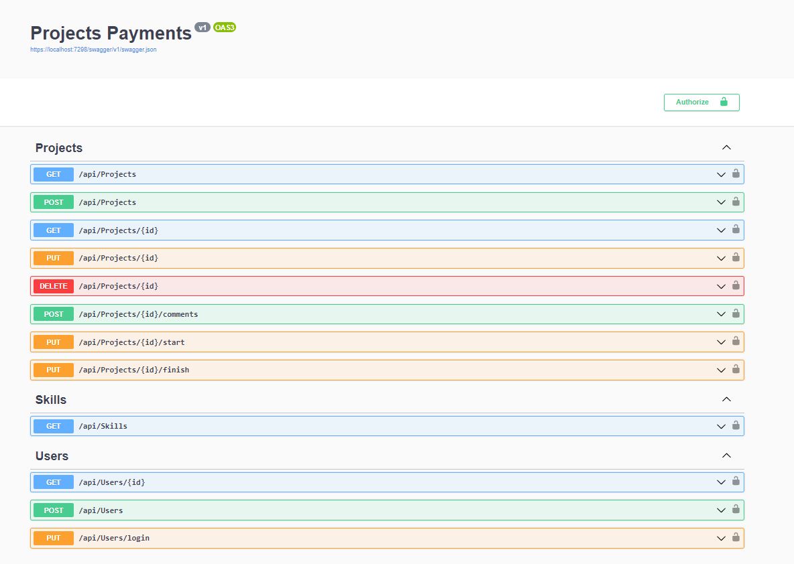

<h1 align="center">Projects Payments</h1>

 

  

Este é um projeto que permite a criação de projetos, login e autenticação de usuários. 
Utilizando Clean Architecture e composto por um microserviço de pagamento, garantindo escalabilidade e manutenção. Utilizando RabbitMQ para a comunicação entre serviços. Além disso, são aplicados diversos padrões de design, incluindo Mediator, CQRS e Repository, para assegurar uma arquitetura robusta e eficiente.

## Tecnologias, Arquitetura e Design Patterns
- Clean Architecture
- Repository
- Entity Framework Core
- CQRS
- MediatR
- JWT (Json Web Token)
- Mensageria com RabbitMQ
- Microsserviço
- Xunit
- FluentValidation
- Moq
- Swagger

## Features
- Criação de usuário
- Autenticação de usuário
- Criação, exclusão e alteração de skills dos usuários freelancers
- Criação, exclusão e alteração do status dos projetos
- Adição de comentários em projetos

## Contact

[@Flaviojcf](mailto:flaviojcostafilho@gmail.com)

